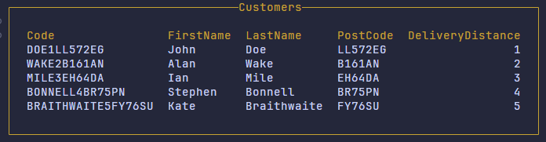
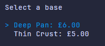
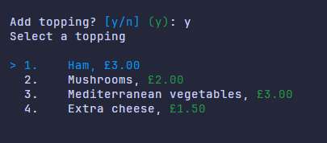
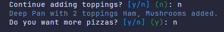
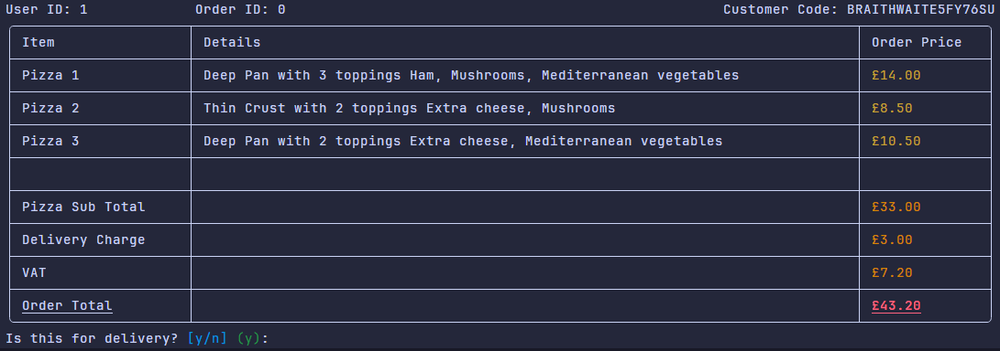

# Evaluation 1

After the initial phase of development, the system fulfills the following functional requirements:

1. Customer Input

    New customers can be created with the `customer add` command. User must provide arguments to the command in order to populate the Customer object. Calling `--help` on the command allows the user to see what arguments are required:

    ```cmd
    ❯ dotnet run -- customer add --help
    DESCRIPTION:
    Add a new customer to system

    USAGE:
        pz customer add <FirstName> <LastName> <Postcode> <HouseNumber> <Distance> [OPTIONS]

    ARGUMENTS:
        <FirstName>
        <LastName>
        <Postcode>
        <HouseNumber>
        <Distance>

    OPTIONS:
        -h, --help    Prints help information
    ```

    Name has been split into distinct `FirstName` and `LastName` properties and `Distance` has been added to the Customer object. This will allow orders for a customer to know early whether delivery will be supported or not.

2. Order Input

    The system handles order construction in the Cli/Presentation layer using extension methods to the `IAnsiConsole` interface. This enables the use of components from the Spectre.Console library to compose pizzas and orders quite cleanly. Running `order add` requires the user to first select an existing user. This prevents the possibility of adding non-existing or invalid customers to an order.
    

    The system then immediately begins prompting for the required properties to build a pizza, presenting prices clearly:

    

    

    Once a pizza is created, the description is printed to the user for reference:

    

    Based on this I can conclude that the functional requirements have been achieved

    ---

3. Pricing Calculation

Once the order has finished being built, the system automatically displays a summary of the order, with prices for each pizza, the pizza subtotal, VAT and any additional charges clearly displayed:

