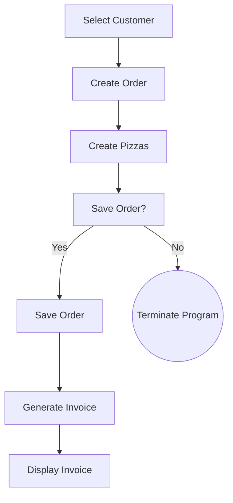

# The Functionality of the System

## High-Level Design

### Customer Flow

```mermaid
flowchart TD

```

### Order Flow

```mermaid
flowchart TD
    A[Select Customer]
    B[Create Order]
    C[Create Pizzas]
    A --> B
    B --> C
    C --> D
    D[Save Order?]
    D --> |Yes| E[Save Order]
    D --> |No| Z((Terminate Program))
    F[Generate Invoice]
    E --> F
    G[Display Invoice]
    F --> G
```

## Low-Level Design